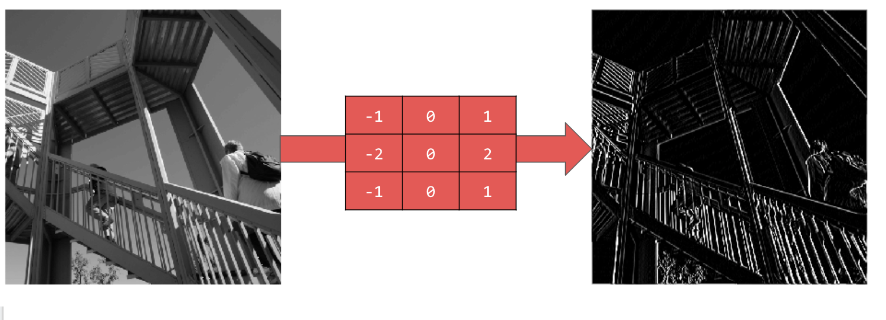
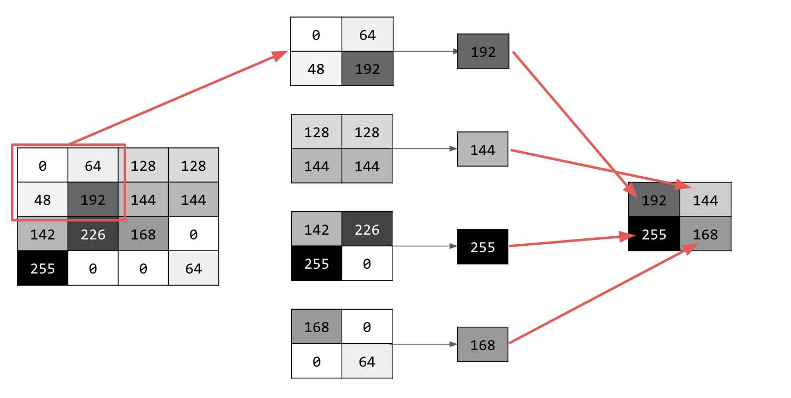

[TOC]

# 机器学习

## 数学基础

### 矩阵


我们使用以下符号：

-   $A \in \mathbb{R}^{m \times n}$，表示 $A$ 为由实数组成具有$m$行和$n$列的矩阵。

-   $x \in \mathbb{R}^{ n}$，表示具有$n$个元素的向量。 **通常，向量$x$将表示列向量**: 即，具有$n$行和$1$列的矩阵。 如果我们想要明确地表示**行向量: 具有 $1$ 行和$n$列的矩阵 - 我们通常写$x^T$（这里$x^T$$x$的转置）**。

-   $x_i$表示向量$x$的第$i$个元素

$$
x=\left[\begin{array}{c}{x_{1}} \\ {x_{2}} \\ {\vdots} \\ {x_{n}}\end{array}\right]
$$

-   我们使用符号 $a_{ij}$（或$A_{ij}$,$A_{i,j}$等）来表示第 $i$ 行和第$j$列中的 $A$ 的元素：

$$
A=\left[\begin{array}{cccc}{a_{11}} & {a_{12}} & {\cdots} & {a_{1 n}} \\ {a_{21}} & {a_{22}} & {\cdots} & {a_{2 n}} \\ {\vdots} & {\vdots} & {\ddots} & {\vdots} \\ {a_{m 1}} & {a_{m 2}} & {\cdots} & {a_{m n}}\end{array}\right]
$$


-   我们用$a^j$或者$A_{:,j}$表示矩阵$A$的第$j$列：

$$A=\left[\begin{array}{llll}{ |} & { |} & {} & { |} \\ {a^{1}} & {a^{2}} & {\cdots} & {a^{n}} \\ { |} & { |} & {} & { |}\end{array}\right]$$


-   我们用$a^T_i$或者$A_{i,:}$表示矩阵$A$的第$i$行：

$$A=\left[\begin{array}{c}{-a_{1}^{T}-} \\ {-a_{2}^{T}-} \\ {\vdots} \\ {-a_{m}^{T}-}\end{array}\right]$$


-   在许多情况下，将矩阵视为列向量或行向量的集合非常重要且方便。 通常，在向量而不是标量上操作在数学上（和概念上）更清晰。只要明确定义了符号，用于矩阵的列或行的表示方式并没有通用约定。

1. 加法

2. 减法
   
**3. 乘法**


-   矩阵乘法结合律: $(AB)C = A(BC)$

-   矩阵乘法分配律: $A(B + C) = AB + AC$

-   矩阵乘法通常不是可交换的; 也就是说，通常$AB \ne BA$。 （例如，假设$  A \in \mathbb{R}^ {m \times n}，$ $B \in \mathbb{R}^ {n \times p} $，如果$m$和$q$不相等，矩阵乘积$BA$甚至不存在！）


**4. 单位矩阵**

**单位矩阵**,$I \in \mathbb{R}^{n \times n} $，它是一个方阵，对角线的元素是1，其余元素都是0：
$$
I_{i j}=\left\{\begin{array}{ll}{1} & {i=j} \\ {0} & {i \neq j}\end{array}\right.
$$
对于所有$A \in \mathbb{R}^ {m \times n}$，有：
$$
AI = A = IA
$$
注意，在某种意义上，单位矩阵的表示法是不明确的，因为它没有指定$I$的维数。通常，$I$的维数是从上下文推断出来的，以便使矩阵乘法成为可能。 例如，在上面的等式中，$AI = A$中的E是$n\times n$矩阵，而$A = IA$中的$I$是$m\times m$矩阵。


1. 逆矩阵

**6. 矩阵转置**

矩阵的转置是指翻转矩阵的行和列。

给定一个矩阵：

$A \in \mathbb{R}^ {m \times n}$, 它的转置为$n \times m$的矩阵$A^T \in \mathbb{R}^ {n \times m}$ ，其中的元素为：
$$
(A^T)_{ij} = A_{ji}
$$
事实上，我们在描述行向量时已经使用了转置，因为列向量的转置自然是行向量。

转置的以下属性很容易验证：

- $(A^T )^T = A$
- $ (AB)^T = B^T A^T$
- $(A + B)^T = A^T + B^T$


## 机器学习

### 监督学习

- 回归问题

- 分类问题

### 代价函数 cost function


### 无监督学习

- 聚类算法

- 异常检测

- 降维


### 线性回归


### 分类模型


## 神经网络


## pytorch

[pytorch](https://pytorch.org/)

[pytorch docs](https://pytorch.org/docs/stable/index.html)

[pytorch 中文文档](https://pytorch.apachecn.org/#/)

## tensorflow

[tensorflow](https://www.tensorflow.org/) 

[api_docs](https://www.tensorflow.org/api_docs/python/tf)

[tensorflow 免费课程](https://www.tensorflow.org/resources/learn-ml#courses)

## 神经网络

## 卷积神经网络

相当于过滤器

# nvidia ai

[nvidia 文档](https://docs.nvidia.com/)

[cuda 历史版本](https://developer.nvidia.com/cuda-toolkit-archive) GPU驱动

[cuda 最新版本文档](https://docs.nvidia.com/cuda/)

[tao-toolkit](https://developer.nvidia.com/tao-toolkit) 训练SDK

[tao 下载](https://catalog.ngc.nvidia.com/orgs/nvidia/teams/tao/resources/tao-getting-started)

[tao 文档](https://docs.nvidia.com/tao/tao-toolkit/index.html)

[tao 文档](https://docs.nvidia.com/tao/)

[tao 安装](https://docs.nvidia.com/tao/tao-toolkit/text/tao_toolkit_quick_start_guide.html#installing-the-pre-requisites)


[快速搭建基于Python和NVIDIA TAO Toolkit的深度学习训练环境](https://www.bilibili.com/video/BV1CS4y1D7KZ/?spm_id_from=333.999.0.0&vd_source=2a18e529afba9d517bd1187c8f358246)

[快速搭建基于TensorRT和NVIDIA TAO Toolkit的深度学习训练](https://www.bilibili.com/video/BV1s341147NG/?spm_id_from=333.999.0.0&vd_source=2a18e529afba9d517bd1187c8f358246)

[tensorrt](https://developer.nvidia.com/tensorrt) 部署的时候优化推理

[tensorrt 开始](https://developer.nvidia.com/tensorrt-getting-started)

[tensorrt 文档](https://docs.nvidia.com/deeplearning/tensorrt/archives/index.html)

[tensorrt 开发文档](https://docs.nvidia.com/deeplearning/tensorrt/developer-guide/index.html)

[tensorrt 安装](https://docs.nvidia.com/deeplearning/tensorrt/install-guide/index.html)

[Torch-TensorRT](https://catalog.ngc.nvidia.com/orgs/nvidia/containers/pytorch)

[TensorFlow-TensorRT](https://catalog.ngc.nvidia.com/orgs/nvidia/containers/tensorflow)

[deepstream](https://developer.nvidia.com/deepstream-sdk)  部署SDK

[deepstream下载](https://developer.nvidia.com/deepstream-getting-started)

[deepstream历史版本](https://developer.nvidia.com/embedded/deepstream-on-jetson-downloads-archived)

[deepstream文档](https://docs.nvidia.com/metropolis/deepstream/dev-guide/)

[deepstream-jetson安装](https://docs.nvidia.com/metropolis/deepstream/dev-guide/text/DS_Quickstart.html#jetson-setup)

- 例子

[github NVIDIA-AI-IOT](https://github.com/NVIDIA-AI-IOT)

[deepstream_tao_apps](https://github.com/NVIDIA-AI-IOT/deepstream_tao_apps)

[deep-learning](https://developer.nvidia.com/deep-learning)


## Google TF

## 神经网络

```sh
model = tf.keras.models.Sequential([tf.keras.layers.Flatten(),
                                    tf.keras.layers.Dense(128, activation=tf.nn.relu),
                                    tf.keras.layers.Dense(10, activation=tf.nn.softmax)])
```

Sequential 定义了神经网络中的层序列。
Flatten 会接受一个正方形并将其转换为一维矢量。
Dense 会添加一层神经元。
Activation 函数会告知各层神经元要执行的操作。选项有很多，但目前只采用以下选项：
Relu 实际上意味着，如果 X 大于 0，则返回 X，否则返回 0。它只会将 0 或更大的值传递到网络中的下一层。
Softmax 会接受一组值，并能有效地选择最大的值。例如，如果最后一层的输出是 [0.1, 0.1, 0.05, 0.1, 9.5, 0.1, 0.05, 0.05, 0.05]，那么您无需通过排序来获取最大值，它会返回 [0,0,0,0,1,0,0,0,0]。


现在已定义了模型，接下来要做的是构建模型。我们来创建模型，先使用 optimizer 和 loss 函数编译模型，然后使用训练数据和标签训练模型。目标是让模型确定训练数据与其训练标签之间的关系。稍后，您希望模型看到与训练数据类似的数据，然后预测该数据应是什么样的。

请注意，我们使用了 metrics= 参数，这样的话，TensorFlow 可根据已知答案（标签）检查预测结果，从而报告训练准确率。

```sh
model.compile(optimizer = tf.keras.optimizers.Adam(),
              loss = 'sparse_categorical_crossentropy',
              metrics=['accuracy'])

model.fit(training_images, training_labels, epochs=5)

```

## 卷积 

卷积是一种过滤条件，可遍历图片、对其进行处理，然后提取重要的特征。




## 池话

与卷积类似，池化对特征检测有很大帮助。池化层可减少图像中的所有信息量，同时维持检测到的特征。

池化类型有多种，但您可以使用名为“最大池化”的池化类型。

迭代图片，并在每个点上考虑像素及其右侧、下方和右下方直接邻近像素。取其中最大的（即最大池化），并将其加载到新图像中。因此，新图像的大小将是旧图像的四分之一。





## 构建卷积神经网络 (CNN) 以增强计算机视觉

```py
import tensorflow as tf
print(tf.__version__)
mnist = tf.keras.datasets.fashion_mnist
(training_images, training_labels), (test_images, test_labels) = mnist.load_data()

# 这是因为第一个卷积需要一个包含所有内容的张量，因此，您只有一个 60000x28x28x1 的 4D 列表，
# 而不是在列表中包含 60000 个 28x28x1 项，测试图像也是如此。否则，您在训练时将收到错误消息，因为卷积无法识别其形状。


training_images=training_images.reshape(60000, 28, 28, 1)

# 归一化
training_images=training_images / 255.0

test_images = test_images.reshape(10000, 28, 28, 1)

# 归一化
test_images=test_images / 255.0

model = tf.keras.models.Sequential([
  # 卷积神经 来提取图像特征
  tf.keras.layers.Conv2D(64, (3, 3), activation='relu', input_shape=(28, 28, 1)),
  # 进行池话 即最大池化 
  tf.keras.layers.MaxPooling2D(2, 2),
  # 卷积神经 来提取图像特征
  tf.keras.layers.Conv2D(64, (3, 3), activation='relu'),
  # 进行池话 即最大池化
  tf.keras.layers.MaxPooling2D(2,2),
  
  # 2维图像 展开成一维图像
  tf.keras.layers.Flatten(),
  tf.keras.layers.Dense(128, activation='relu'),
  tf.keras.layers.Dense(10, activation='softmax')
])
# 编译模型
model.compile(optimizer='adam', loss='sparse_categorical_crossentropy', metrics=['accuracy'])

#  查看网络的大小和形状
model.summary()


# 编译模型，调用拟合方法进行训练，然后评估测试集的损失和准确率。


# 训练模型 训练5次
model.fit(training_images, training_labels, epochs=5)

# 验证模型
test_loss, test_accuracy = model.evaluate(test_images, test_labels)
print ('Test loss: {}, Test accuracy: {}'.format(test_loss, test_accuracy*100))
```