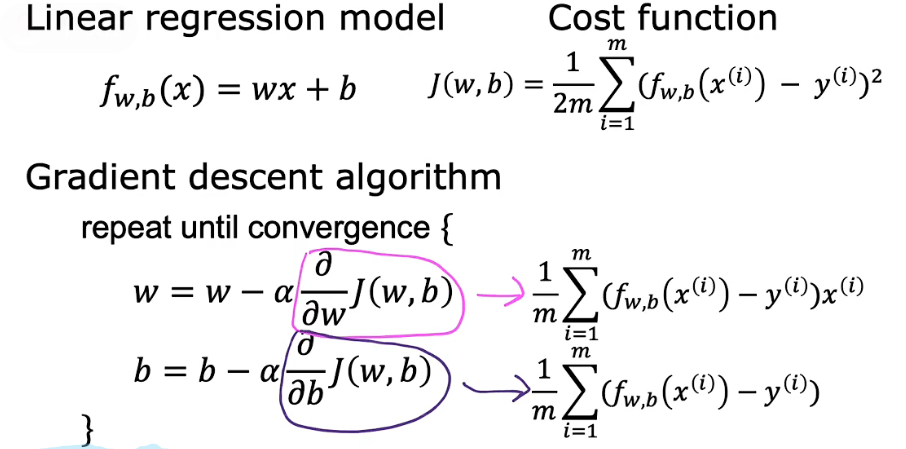
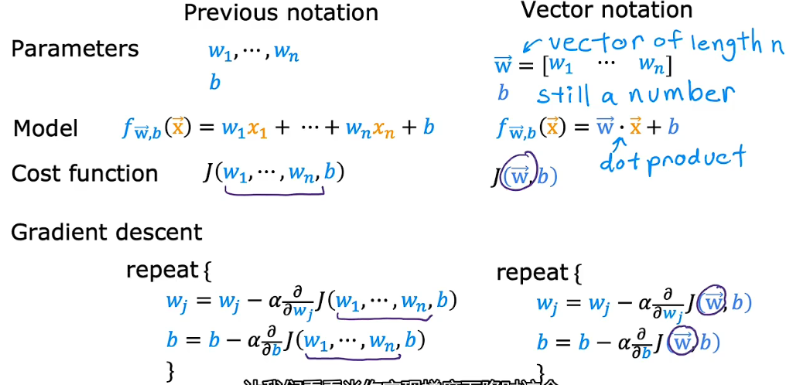
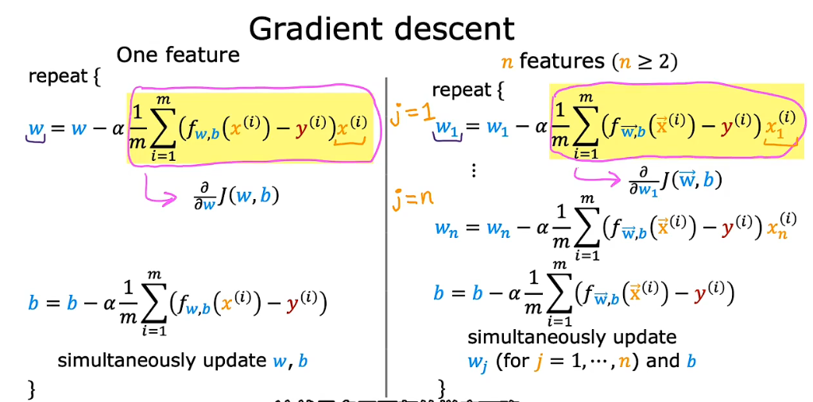
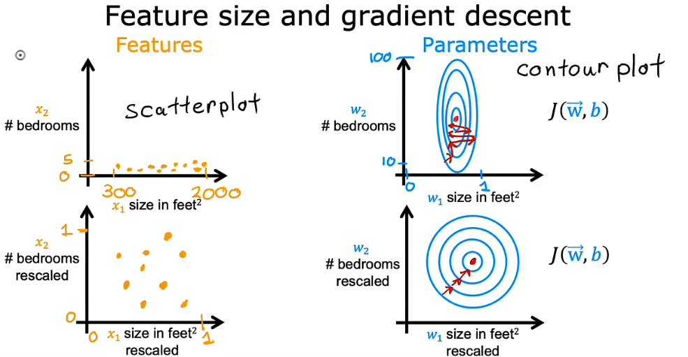

[TOC]

# 机器学习

## 监督学习

### 单元线性回归

#### 线性模型

> 线性回归模型(model)

fw,b(x)=wx+b: 

#### 成本函数(Cost Function )

> 采用误差(预测的y值与目标y(i)值之差)的平方之和除以两倍样本数

$$ J(w,b) = \frac{1}{2m} \sum\limits_{i = 0}^{m-1} (f_{w,b}(x^{(i)}) - y^{(i)})^2 $$

#### 梯度下降函数(Gradient Descent)

$\alpha$:学习率learning rate，控制学习时w和b的步长。学习率选择的不同会影响成本函数的收敛与否，直接关系到梯度下降法能否得到有效解,$\alpha$ 过大会导致发散，过小会增加迭代次数，影响学习效率。

### 多元线性回归 Multiple linear regression

#### 线性模型

> 线性回归模型(model)

fw,b(x)=wx+b: 

#### 成本函数(Cost Function )

> 采用误差(预测的y值与目标y(i)值之差)的平方之和除以两倍样本数

$$ J(w,b) = \frac{1}{2m} \sum\limits_{i = 0}^{m-1} (f_{w,b}(x^{(i)}) - y^{(i)})^2 $$

#### 梯度下降函数(Gradient Descent)

$\alpha$:学习率learning rate，控制学习时w和b的步长。学习率选择的不同会影响成本函数的收敛与否，直接关系到梯度下降法能否得到有效解,$\alpha$ 过大会导致发散，过小会增加迭代次数，影响学习效率。

#### 特征缩放(Feature scaling)与特征工程(Feature engineering)

- **特征缩放:** 当有不同的特征数据，且他们的取值范围非常不同时，可能会导致梯度下降运行缓慢。此时重新缩放不同的特征（对数据做类似于归一化处理），可以使数据分布较为均匀，让梯度下降的效率更高。

- **特征工程:** 通过你个人对问题的理解以及直觉，对原始的数据进行相关变换得到新的数据，再进行机器学习。

## 无监督学习

## 强化学习