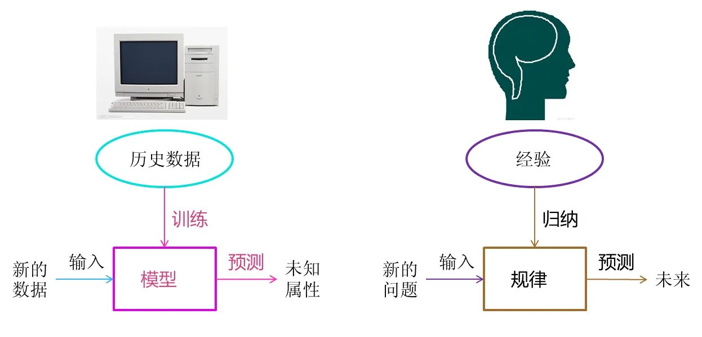

# 机器学习

- 机器学习是人工智能的一个子方向。

- 机器学习有点像人类的学习过程。

- 人类学习通过经验，归纳出规律。

- 机器学习通过数据，训练出模型。

- 机器学习不是基于编程形成的直接结果，而是通过归纳得出来的模型。

- 机器学习中，会用一些真实的数据对算法构建的模型进行评估，评估模型的性能，如果这个模型能达到要求，就用来测试其他的数据，如果达不到要求就要调整算法来重新建立模型，再次进行评估，如此循环往复，最终获得满意的模型来处理其他的数据。

## 监督学习

> 监督学习是指在训练的时候就知道正确结果。

注：比如，教小孩子给水果分类，先给他一个苹果，然后告诉他，这是苹果，再给他一个苹果，接着告诉他，这是苹果，经过这样反复的训练学习，如果再给他苹果的时候，问他，这是什么？他会告诉你，这是苹果。如果给他一个梨，他会告诉你，这不是苹果。

> 监督学习分为两类：回归 ( Regression ) 和分类 ( Classification )。
>
> 其实回归问题和分类问题的本质一样，都是针对一个输入做出一个输出预测，其区别在于输出的类型。

### 回归 ( Regression )

> 输出值是连续值

回归问题是根据训练集训练出一个模型，这个模型能推断一个新的输入所对应的输出值是多少，它是一种连续变量的预测。

### 分类 ( Classification )

> 输出值是离散值

分类问题是根据训练集训练出一个模型，这个模型能推断一个新的输入所对应的类别什么，它是一种离散变量预测。

## 无监督学习

> 无监督学习的基本想法是找到数据的潜在结构

注：无监督学习常用的方法有聚类、降维、话题分析等。

注：例如，给小孩子一堆水果，比如有苹果、橘子、梨三种，小孩子一开始不知道这些水果是什么，让小孩子对这堆水果进行分类。等小孩子分类完后，给他一个苹果，他应该把他这个苹果放到刚刚分好的苹果堆中去。

## 代价函数

> 衡量模型预测出来的值 h(θ) 与真实值 y 之间差异的函数叫做代价函数J(θ)。

代价函数值越小说明模型和参数越符合训练样本(x, y)对应的模型。

代价函数是用来找到假设函数的最优解的，将求假设函数问题转换为求代价函数问题。

我们常用平方误差代价函数来求假设函数的最优解。

强化学习
线性回归
分类
损失函数
梯度下降
矩阵 加 减 乘 除
向量 